# HTTPS 中的 TLS 握手过程是怎样的？（四次握手都做了什么？）（了解）

**题目**: HTTPS 中的 TLS 握手过程是怎样的？（四次握手都做了什么？）（了解）

**标准答案**:
TLS 握手过程确保客户端和服务器之间建立安全的通信通道，主要包括以下步骤：

1. Client Hello：客户端发送支持的 TLS 版本、加密套件列表和随机数
2. Server Hello：服务器选择 TLS 版本、加密套件并发送随机数
3. 服务器发送证书和 Server Key Exchange（如果需要）
4. Server Hello Done：服务器表示握手消息发送完毕
5. Client Key Exchange：客户端生成预主密钥并用服务器公钥加密后发送
6. Change Cipher Spec：客户端和服务器切换到加密模式
7. Finished：双方发送加密的完成消息

**深入理解**:
详细的 TLS 1.2 握手过程：

```mermaid
graph LR
    A[Client Hello: version, random, cipher suites] --> B[Server Hello: version, random, cipher suite]
    B --> C[Certificate: server's public key certificate]
    C --> D[Server Key Exchange: optional parameters]
    D --> E[Server Hello Done]
    E --> F[Client Key Exchange: encrypted pre-master secret]
    F --> G[Change Cipher Spec]
    G --> H[Encrypted Handshake Message]
    H --> I[Change Cipher Spec]
    I --> J[Encrypted Handshake Message]
```



**详细步骤**：

1. **Client Hello**：
   - 客户端发送支持的最高 TLS 版本
   - 客户端随机数（Client Random）
   - 支持的加密套件列表
   - 会话 ID（用于会话恢复）

2. **Server Hello**：
   - 服务器选择的 TLS 版本
   - 服务器随机数（Server Random）
   - 服务器选择的加密套件
   - 会话 ID

3. **Certificate**：
   - 服务器发送其数字证书（包含公钥）
   - 证书包含服务器身份信息和 CA 签名

4. **Server Key Exchange**（可选）：
   - 某些加密套件需要额外的密钥交换参数

5. **Server Hello Done**：
   - 服务器表示握手信息发送完毕

6. **Client Key Exchange**：
   - 客户端生成预主密钥（Pre-Master Secret）
   - 使用服务器公钥加密预主密钥
   - 发送给服务器

7. **Change Cipher Spec**：
   - 客户端切换到加密通信模式
   - 发送加密的握手完成消息

8. **Server Change Cipher Spec**：
   - 服务器切换到加密通信模式
   - 发送加密的握手完成消息

**密钥生成过程**：
- 预主密钥（Pre-Master Secret）由客户端生成
- 主密钥（Master Secret）通过 PRF（伪随机函数）从预主密钥、客户端随机数和服务器随机数生成
- 会话密钥从主密钥派生，用于实际的加密通信

**TLS 1.3 的改进**：
- 减少了握手往返次数（1-RTT 或 0-RTT）
- 移除了不安全的加密算法
- 提高了连接建立速度

```javascript
// 在实际开发中，我们通常不需要手动实现 TLS 握手
// 但了解其原理有助于理解 HTTPS 安全性

// 检测当前连接是否为 HTTPS
function isHttpsConnection() {
  return window.location.protocol === 'https:' ||
         window.location.href.startsWith('https://');
}

// 检查页面是否在安全上下文中
function isSecureContext() {
  return window.isSecureContext; // 返回 true 表示在 HTTPS 环境中
}

console.log('当前是否为 HTTPS 连接:', isHttpsConnection());
console.log('是否在安全上下文:', isSecureContext());
```

**性能优化**：
- 会话恢复（Session Resumption）：减少握手时间
- TLS False Start：允许客户端在握手完成前发送应用数据
- OCSP Stapling：提高证书验证效率
