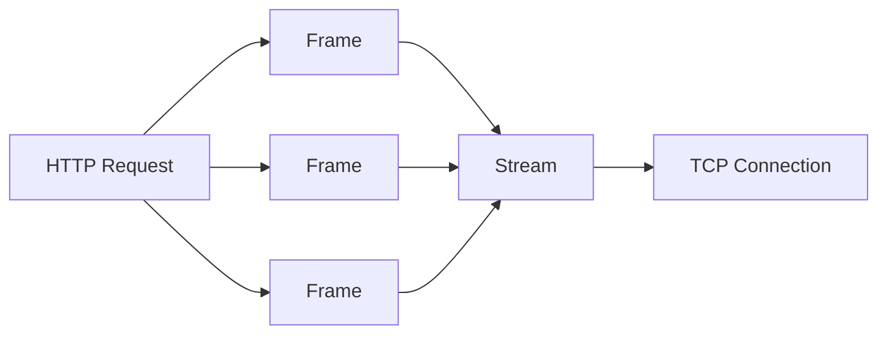

# HTTP/2 相比于 HTTP/1.1 有什么提升？（了解）

**题目**: HTTP/2 相比于 HTTP/1.1 有什么提升？（了解）

**标准答案**:
HTTP/2 相比于 HTTP/1.1 的主要提升包括：

1. 二进制协议：HTTP/2 使用二进制格式而非文本格式，解析效率更高
2. 多路复用：允许在单个连接上并行发送多个请求和响应
3. 头部压缩：使用 HPACK 算法压缩头部，减少传输数据量
4. 服务器推送：服务器可以主动推送资源给客户端
5. 优先级控制：可以为请求设置优先级，优化资源加载顺序

**深入理解**:
HTTP/2 的关键技术特性：

**1. 二进制分帧层（Binary Framing Layer）**:
HTTP/2 将所有传输的信息分割为更小的消息和帧，并采用二进制格式编码。



**2. 多路复用（Multiplexing）**:
在 HTTP/1.1 中，浏览器通常对每个域名限制 6-8 个并发连接，而 HTTP/2 允许在同一个连接上同时发送多个请求和响应。

```javascript
// HTTP/1.1 的问题：队头阻塞
// 请求1 -> 响应1 -> 请求2 -> 响应2 -> 请求3 -> 响应3

// HTTP/2 的改进：多路复用
// 请求1、请求2、请求3 -> 同时传输 -> 响应1、响应2、响应3
```

**3. 头部压缩（Header Compression）**:
HTTP/2 使用 HPACK 压缩算法，通过静态字典、动态表和霍夫曼编码减少头部大小。

```javascript
// HTTP/1.1 每个请求都包含完整的头部
// GET / HTTP/1.1
// Host: example.com
// User-Agent: Mozilla/5.0
// Accept: text/html
// Cookie: sessionid=abc123...

// HTTP/2 压缩后的头部更小
// 使用索引和霍夫曼编码压缩常用头部
```

**4. 服务器推送（Server Push）**:
服务器可以主动推送客户端可能需要的资源。

```javascript
// 服务器推送示例
// 当请求 index.html 时，服务器主动推送 style.css 和 script.js
// 而不需要等待浏览器解析 HTML 后再发起请求
```

**5. 流优先级（Stream Prioritization）**:
允许客户端指定资源的优先级，优化加载顺序。

**性能提升示例**:

```javascript
// 检测是否支持 HTTP/2
function supportsHTTP2() {
  // 注意：浏览器 API 中没有直接检测 HTTP/2 的方法
  // 但可以通过服务器配置检测
  return new Promise((resolve) => {
    const request = new XMLHttpRequest();
    request.open('GET', '/http2-test', true);
    
    // 检查连接信息（需要服务器支持）
    request.onreadystatechange = function() {
      if (request.readyState === 4) {
        // 通常 HTTP/2 与 HTTPS 结合使用
        resolve(location.protocol === 'https:');
      }
    };
    request.send();
  });
}

// HTTP/2 性能优化的实际应用
class HTTP2ResourceLoader {
  constructor() {
    this.connection = new Map(); // 模拟连接池
  }
  
  async loadResources(urls) {
    // 在 HTTP/2 中，所有请求都可以在单个连接上并行执行
    const requests = urls.map(url => fetch(url));
    const responses = await Promise.all(requests);
    return Promise.all(responses.map(r => r.json()));
  }
  
  // 服务器推送模拟（实际由服务器实现）
  async pushResource(resourceUrl) {
    // 在 HTTP/1.1 中需要单独请求
    // 在 HTTP/2 中服务器可以主动推送
    return fetch(resourceUrl);
  }
}
```

**HTTP/2 的限制**:
- 仍然依赖 TCP 协议，存在队头阻塞问题（在传输层）
- 需要 HTTPS 支持（虽然不是协议强制，但浏览器强制要求）
- 对于小文件，HTTP/1.1 + CDN 可能表现更好

**实际应用**:
- 现代网站应尽可能使用 HTTP/2
- 结合服务器推送优化关键资源加载
- 注意资源打包策略，HTTP/2 中过多的资源合并可能不是最佳选择
- 合理设置资源优先级，优化用户体验
